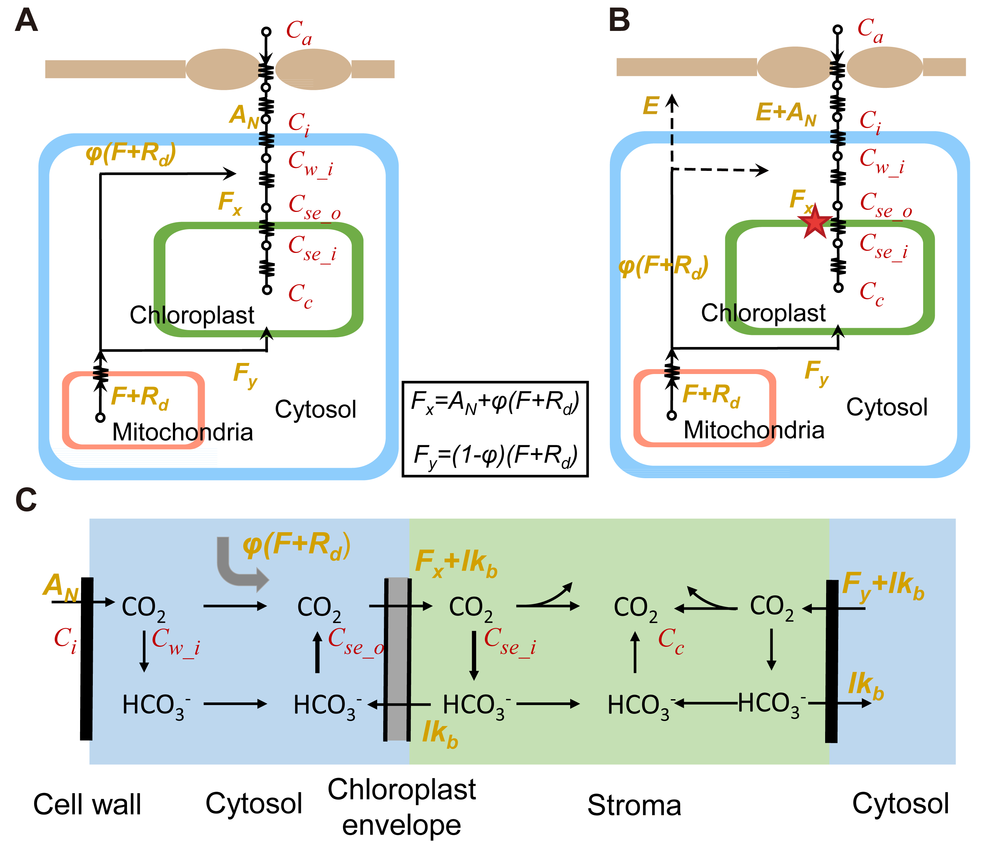

# An Analytical Formula Representing Mesophyll Resistance as a Property of a Complex Biophysical, Biochemical, and Anatomical System
Components of mesophyll resistance and their reponses to light and CO2 are systematically studied using a 3D cell model, a 3D leaf model and an explicit analytical formula.

	 

**[Reference]**
Xiao Y, Zhu X-G. (2017) Components of mesophyll resistance and their environmenal responses: A theoretical modelling analysis. Plant, Cell & Environment.
[https://doi.org/10.1111/pce.13040](https://doi.org/10.1111/pce.13040)

## Versioning  
The origianl supplementary excel worksheet uses VB macros, which are not working anymore. This is an equivalent version without macros.

## Authors  
* code by **Yi Xiao** - *yixiao20@outlook.com* - [https://github.com/xiaoyizz78](https://github.com/xiaoyizz78)

